# Procesos
## ps

```bash 
ps a
```
> Muestra todos los procesos asociados al terminal actual (incluidos los de otros usuarios).

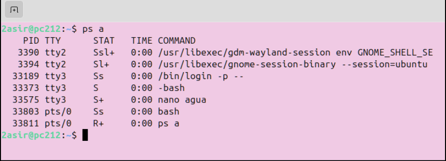
---
```bash 
ps au
```
> Lista los procesos con detalles adicionales, como el usuario propietario, el consumo de CPU y memoria, y el comando ejecutado.

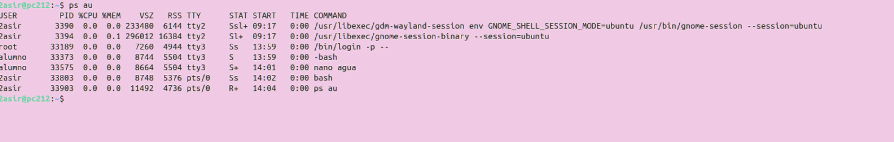
---
```bash 
ps aux
```
> Similar a ps au, pero muestra procesos de todos los usuarios y no se limita al terminal actual.

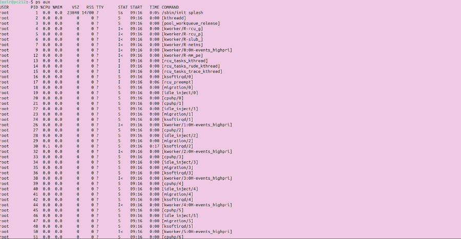
---
```bash 
ps -C nano
```
> Filtra y muestra información sobre los procesos cuyo comando es nano.

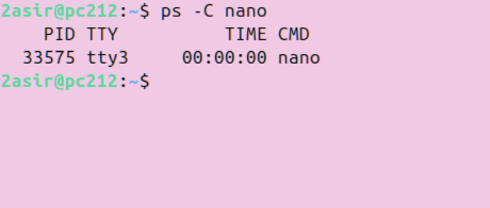
---
```bash 
ps -eo user,pid,command,comm,%cpu,%mem --sort=-%cpu | head -n 6
```
>Lista procesos con columnas personalizadas ```(user, pid, command, comm, %cpu, %mem)``` ordenados por mayor uso de CPU ```(--sort=-%cpu)``` y muestra las primeras 6 líneas ```(head -n 6)```.

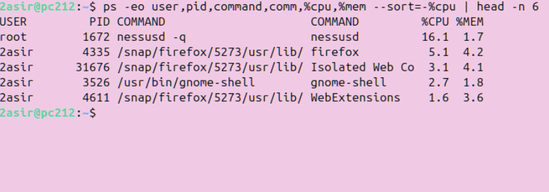
---
## top
```bash 
top -b -n 1 > top.txt
cat top.txt
```
> Ejecuta top en modo batch ```(-b)``` una vez ```(-n 1)``` y guarda la salida en el archivo top.txt.

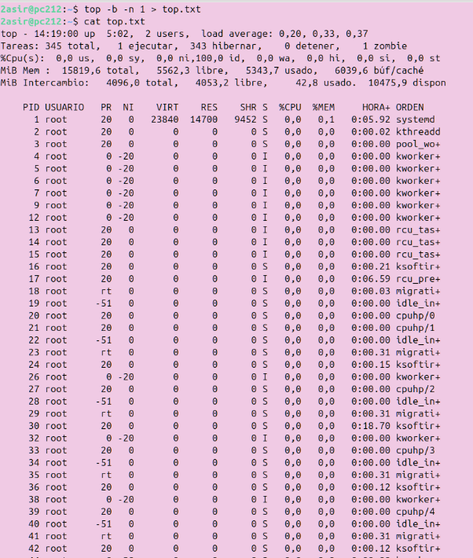
---
```bash 
top -b -n 3 -o +%CPU|head -n 17 > procesos.txt
cat procesos.txt
```
> Ejecuta top en modo batch ```(-b)``` tres veces ```(-n 3)```, ordena por uso de CPU ```(-o +%CPU)```, muestra las primeras 17 líneas ```(head -n 17)``` y guarda el resultado en procesos.txt.

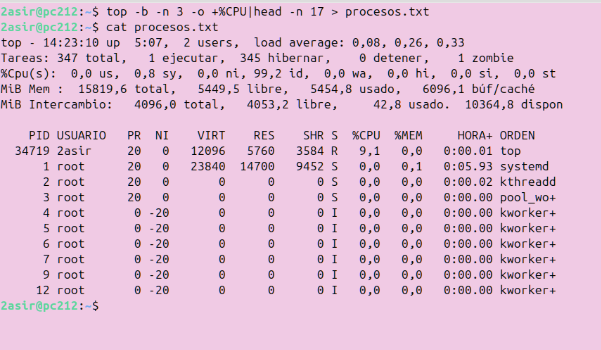
---

```bash 
atop
```
>atop: Es una herramienta avanzada de monitorización de sistemas que muestra estadísticas detalladas sobre el uso de CPU, memoria, disco, red y procesos en tiempo real.

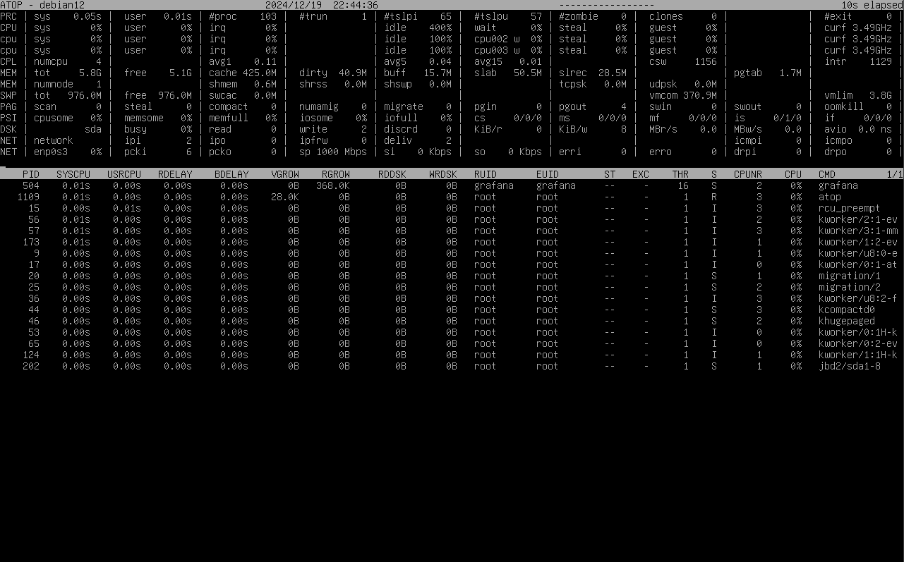
---

# Gestión de memoria y espacios
---
## free
```bash 
free
free -h
free -s 3
```
>free: Muestra un resumen de la memoria RAM y swap en el sistema, en kilobytes por defecto.

>free -h: Igual que free, pero los valores se presentan en formato "legible para humanos" (KB, MB, GB).

>free -s 3: Actualiza la información de memoria cada 3 segundos.

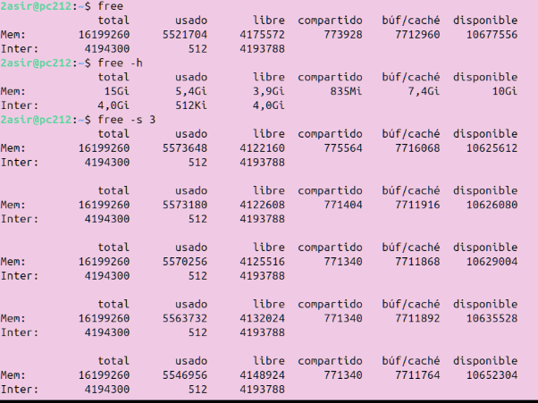
---
## df
```bash 
df -h
df -h /
```
>df -h: Muestra el uso del espacio en disco de todos los sistemas de archivos en formato legible para humanos.

>df -h /: Muestra el uso del espacio en disco únicamente para el sistema de archivos donde está montado / (la raíz).

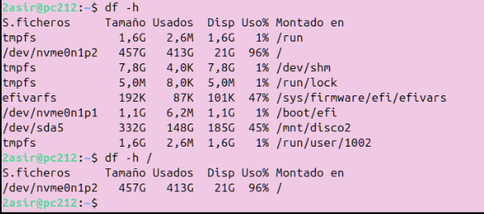
---
## du
```bash 
sudo du -hs
sudo du -hs /home
```
>sudo du -hs: Calcula el tamaño total del directorio actual y lo muestra en formato legible para humanos ```(-h)```, resumiendo en una única línea ```(-s)```.

>sudo du -hs /home: Igual que el anterior, pero calcula el tamaño total del directorio /home.

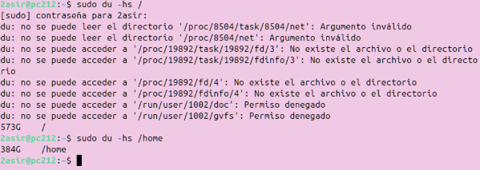
---

```bash 
sudo du -hd 1 /home
```
>sudo du -hd 1 /home: Muestra el tamaño de /home y sus subdirectorios inmediatos (profundidad 1), en formato legible para humanos.

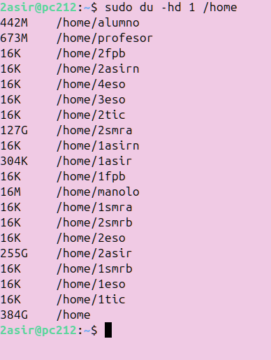
---

## iostat
```bash 
iostat -x nvme0n1
```
>iostat -x nvme0n1: Muestra estadísticas extendidas ```(-x)``` de uso del dispositivo de almacenamiento nvme0n1, como tiempo de espera, uso porcentual y tasas de lectura/escritura.

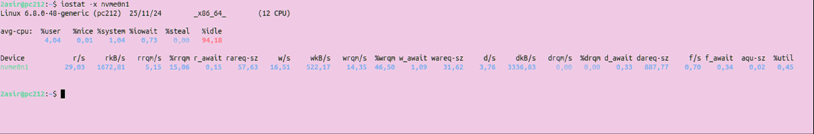
---

# Red
---
## tcpdump
```bash 
sudo tcpdump
```
>tcpdump: Captura y muestra paquetes de red en tiempo real en la interfaz predeterminada.

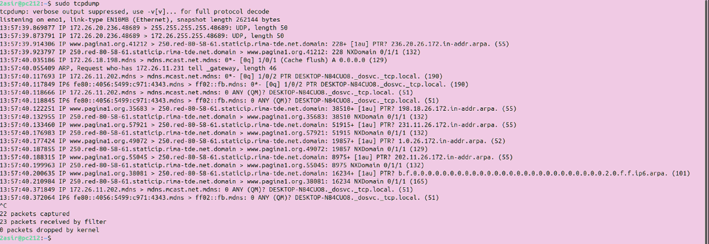
---

```bash 
tcpdump -i eno1
```
>tcpdump -i eno1: Captura paquetes en la interfaz específica eno1.

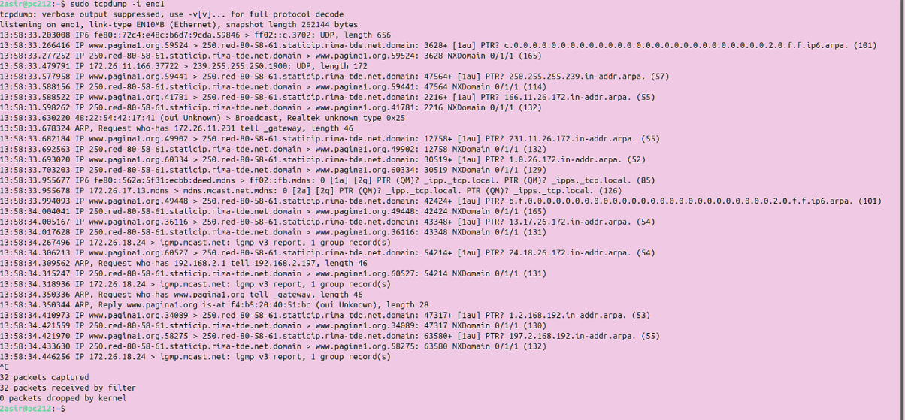
---

```bash 
tcpdump -i eno1 -w capturas
```
>tcpdump -i eno1 -w capturas: Captura paquetes en la interfaz eno1 y los guarda en un archivo llamado ```capturas``` para poder analizarlo.

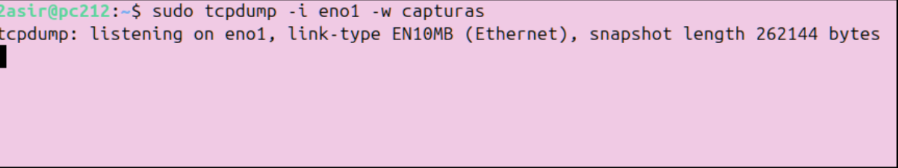
---

## tcptrack
```bash 
tcptrack -i eno1
```
>tcptrack -i eno1: Monitorea conexiones TCP en tiempo real en la interfaz eno1, mostrando el estado de las conexiones y el tráfico.

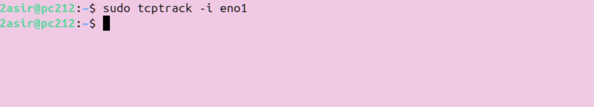
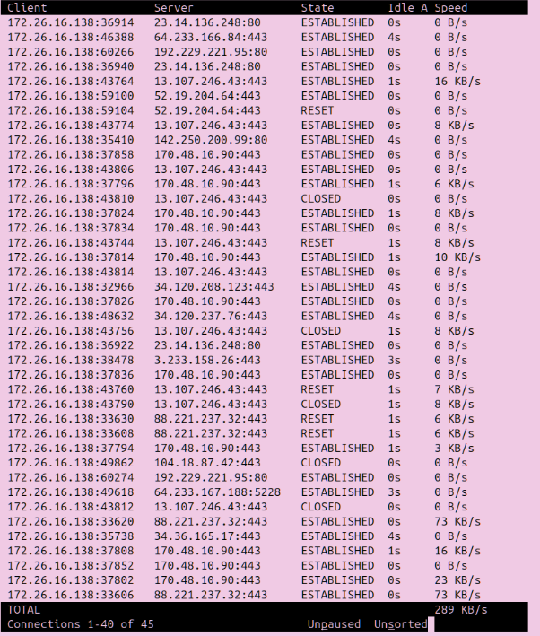
---

## iptraf
```bash 
iptraf
```
>iptraf: Herramienta interactiva para analizar el tráfico de red en tiempo real, incluyendo estadísticas por protocolo, interfaces y direcciones IP.

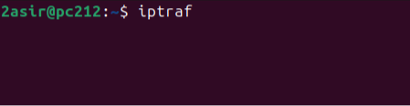
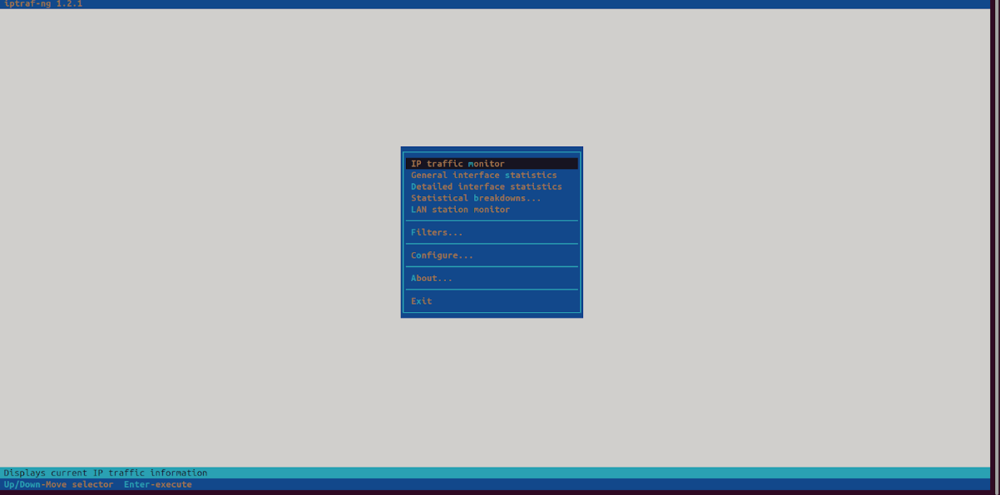
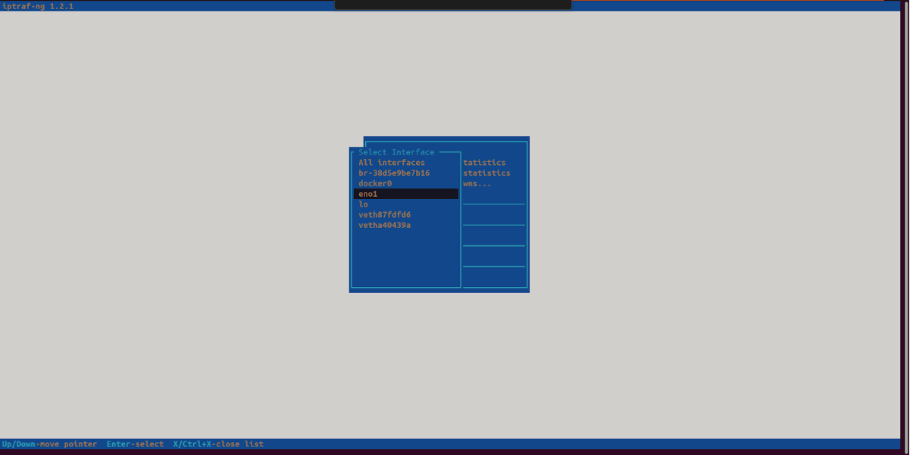
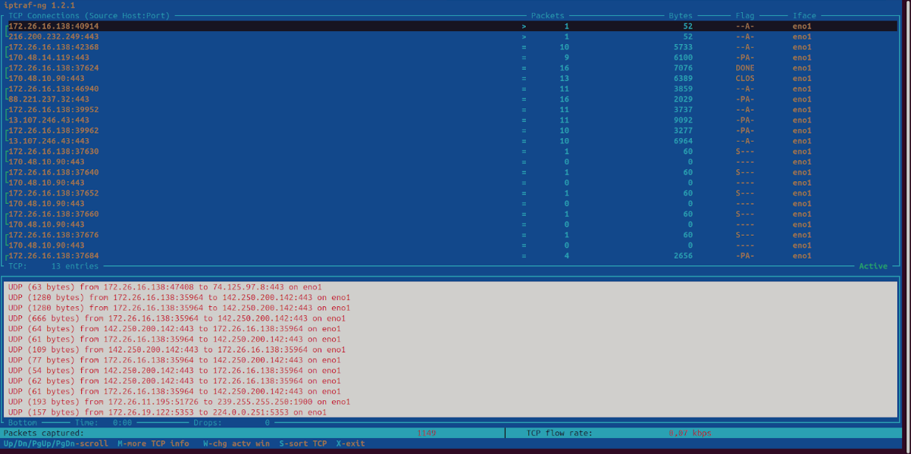
---
## bmon
```bash 
bmon
```
>bmon: Similar a iptrad, monitoriza el ancho de banda en tiempo real, mostrando estadísticas gráficas y detalladas por interfaz de red.

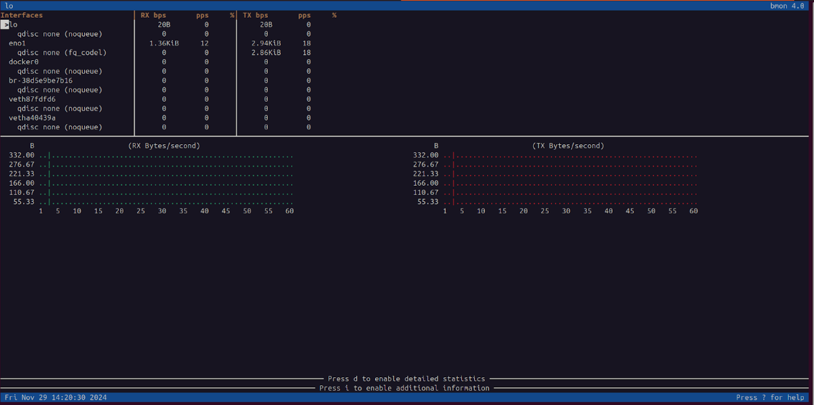
