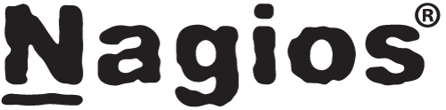
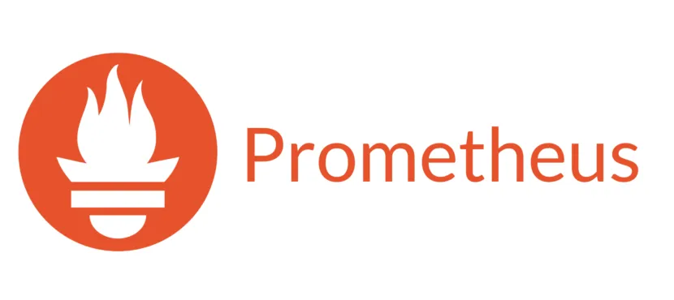

1. Nagios
    * Es una solución de monitorización de infraestructura que permite supervisar servidores, aplicaciones, redes y servicios. Ofrece alertas configurables, informes detallados y soporte para múltiples plugins para adaptarse a diferentes necesidades.
    

2. Zabbix
    * Plataforma de monitorización de código abierto que abarca servidores, dispositivos de red y aplicaciones. Se destaca por su capacidad de recopilar grandes cantidades de datos, alertas avanzadas, y su interfaz gráfica para análisis de métricas y visualización en tiempo real.

        
3. Prometheus
    * Sistema de monitorización y alertas diseñado especialmente para sistemas modernos, como aplicaciones en contenedores. Utiliza un modelo de datos basado en series temporales, métricas pull y permite consultas avanzadas con su lenguaje PromQL.

        